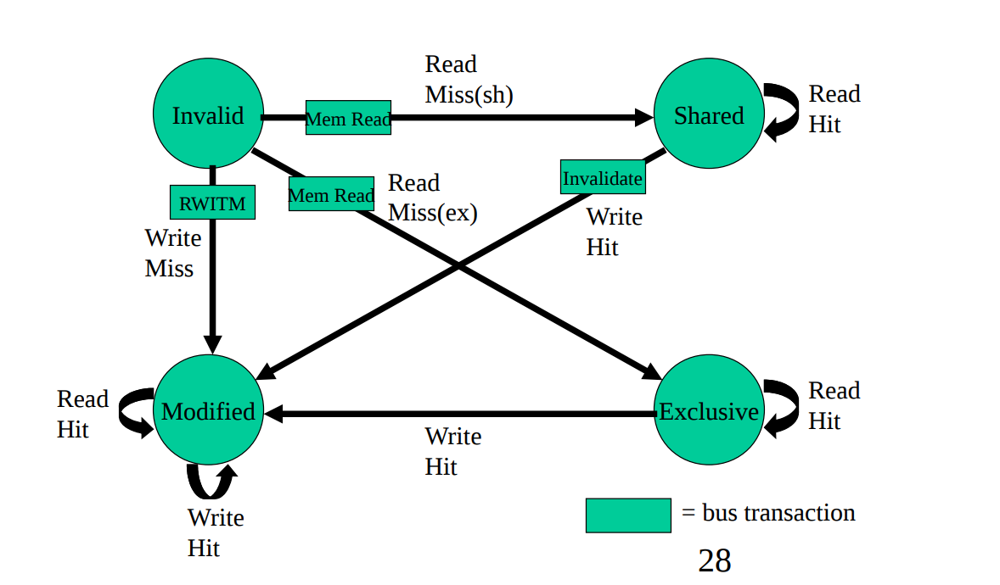
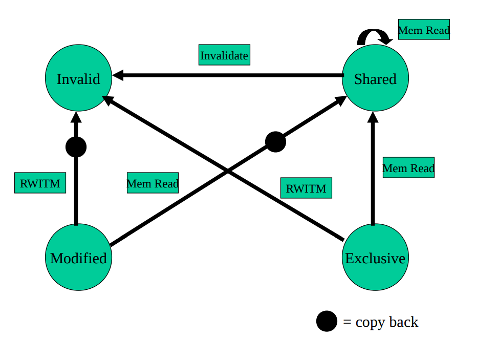

<br />
<div align="center">

  <h1 align="center">L1 Cache Simulator for Quad-Core Processors</h1>
  <p align="center">
    This project implements a detailed simulator for L1 caches in a quad-core processor system using the MESI (Modified-Exclusive-Shared-Invalid) cache coherence protocol.
  </p>

</div>

### Authors
- Laksh Goel (2023CS10848)
- Yuvika Chaudhary (2023CS10353)

# Overview
The simulator models a multi-core system with the following features:
- MESI cache coherence protocol implementation
- Write-back, write-allocate policy
- LRU (Least Recently Used) replacement policy
- Central snooping bus for inter-cache communication
- Support for various cache configurations (sets, associativity, block size)


# Project Structure

```
L1-Cache-Simulator/
├── headers/                  # Header files
│   ├── Bus.hpp               # Bus interface definitions
│   ├── Cache.hpp             # Cache structure definitions
│   ├── CacheLine.hpp         # Cache line structure
│   ├── CacheSet.hpp          # Cache set implementation
│   ├── Memory.hpp            # Memory system interface
│   ├── mesi.hpp              # MESI protocol implementation
│   ├── Processor.hpp         # Processor implementation
│   └── utils.hpp             # Utility functions
├── src/                      # Source files
│   ├── Bus.cpp               # Bus implementation
│   ├── Cache.cpp             # Cache implementation
│   ├── CacheLine.cpp         # Cache line implementation
│   ├── CacheSet.cpp          # Cache set implementation
│   ├── L1simulate.cpp        # Main simulation driver
│   ├── Memory.cpp            # Memory implementation
│   ├── mesi.cpp              # MESI protocol implementation
│   ├── Processor.cpp         # Processor implementation
│   └── utils.cpp             # Utility functions
├── traces/                   # Trace files for simulation
│   ├── app1_proc0.trace      # Instruction trace for core 0
│   ├── app1_proc1.trace      # Instruction trace for core 1
│   └── ...                   # Other trace files
├── Makefile                  # Build system
└── README.md                 # This file
```
# Getting Started

## Prerequisites
- C++ compiler with C++11 support (g++ recommended)
- Linux operating system (tested on Ubuntu/Debian)
- make utility

## Building Project
### 1. Clone the repository and navigate to the project directory:
```bash
git clone https://github.com/lakshgoel5/L1-Cache-Simulator-COL216
cd L1-Cache-Simulator-COL216
```
### 2. Compiling the Project
To compile the simulator, navigate to the src directory and use make:
```bash
cd src
make
```

This will compile the simulator and create the executable `L1simulate`.

### 3. Running the Simulator
The simulator can be run with various configurations using command-line arguments:
```bash
./L1simulate -t <tracefile> -s <sets> -E <associativity> -b <blocksize> -o <output_file>
```

### Command-line Parameters
- `-t`: Trace file prefix (e.g., app1, app2)
- `-s`: Number of set index bits (S = 2^s is the number of sets)
- `-E`: Associativity (number of lines per set)
- `-b`: Number of block bits (B = 2^b is the block size)
- `-o`: Output file for simulation results
- `-h`: Display help message


### Trace file format
Each trace file contains a sequence of memory operations, one per line:
- ``R 0x12345678``: Read operation at memory address 0x12345678
- ``W 0x87654321``: Write operation at memory address 0x87654321

### Simulation Statistics
The simulator generates a detailed report of cache hits, misses, and other statistics for each core. The output file will contain:
- Total Instructions executed
- Total read operations
- Total write operations
- Total execution cycles
- Idle cycles
- Cache miss rate
- Cache Evictions
- Writebacks
- Bus Invalidations
- Data Traffic (in Bytes)

## MESI Protocol Implementation

The MESI protocol is a cache coherence protocol that manages the states of cache lines across multiple processors to maintain data consistency. The name MESI is an acronym derived from the four states that a cache line can be in:

### Cache Line States

1. **M (Modified)**
   - The cache line is present only in the current cache and has been modified (is dirty).
   - The cache has the responsibility to write the data back to main memory when evicted.
   - Memory is not up-to-date.

2. **E (Exclusive)**
   - The cache line is present only in the current cache but has not been modified (is clean).
   - The cache line is consistent with main memory.
   - The processor can transition this line to the Modified state without any bus transactions.

3. **S (Shared)**
   - The cache line may be stored in other caches and is clean (unmodified).
   - Memory is up-to-date.
   - Multiple caches can hold the same line in the Shared state.

4. **I (Invalid)**
   - The cache line is invalid (does not contain valid data).
   - This is the initial state of all cache lines.

### State Transitions

Our implementation handles the following transitions as illustrated in the flow diagrams:

#### Locally Initiated Transitions

These occur when a processor performs read or write operations on its own cache:



- **Read Operations**:
  - **I → E**: When reading an address not in any cache (read miss), the state becomes Exclusive.
  - **I → S**: When reading an address present in other caches (read miss), the state becomes Shared.
  - **S → S, E → E, M → M**: Read hits maintain the current state.

- **Write Operations**:
  - **I → M**: Write miss, the address is not in any cache, state becomes Modified.
  - **S → M**: Write hit on a Shared line, requires an invalidation message to other caches.
  - **E → M**: Write hit on an Exclusive line, simply transitions to Modified (no bus traffic).
  - **M → M**: Write hit on a Modified line, remains Modified.

#### Remotely Initiated Transitions

These occur when a processor reacts to bus requests from other processors:



- **Response to BusRd (Read from another processor)**:
  - **M → S**: If a line is Modified, it must write back to memory and change to Shared.
  - **E → S**: An Exclusive line transitions to Shared when another processor reads it.
  - **S → S**: A Shared line remains Shared.

- **Response to BusRdX (Read with intent to write)**:
  - **M → I, E → I, S → I**: Any valid line must be invalidated.

### Implementation Details

Our simulator implements the MESI protocol with the following features:

1. **Snooping Bus Architecture**:
   - All cache controllers monitor the bus for memory transactions.
   - The bus facilitates communication between caches.

2. **Write-Back Policy**:
   - Modified data is written back to memory only when evicted or when another processor needs it.
   - This reduces memory traffic compared to a write-through policy.

3. **Write-Allocate Policy**:
   - On write misses, the block is loaded into the cache before being updated.

4. **Memory Access Timing**:
   - Memory reads take 100 cycles.
   - Cache-to-cache transfers take 2*N cycles (where N is the block size in words).
   - Write-backs to memory take 100 cycles.

5. **Cache Replacement**:
   - Uses LRU (Least Recently Used) policy for cache line eviction.

### Performance Metrics

The simulator tracks several performance metrics to evaluate the efficiency of the MESI protocol:

- **Miss Rate**: Percentage of memory accesses that result in cache misses.
- **Evictions**: Number of cache lines evicted due to replacement policy.
- **Write-backs**: Number of modified cache lines written back to memory.
- **Bus Invalidations**: Number of invalidate messages sent on the bus.
- **Data Traffic**: Total amount of data transferred over the bus in bytes.

### Example Cache Coherence Scenario

Consider two processors P0 and P1 accessing the same memory address:

1. P0 reads address A (miss) → A is loaded into P0's cache in Exclusive state.
2. P1 reads address A → P0's cache line transitions to Shared, P1 gets a copy in Shared state.
3. P0 writes to address A → Sends invalidation message, P1's copy becomes Invalid, P0's becomes Modified.
4. P1 reads address A again → P0 writes back the Modified data, both caches now have the line in Shared state.

This example demonstrates how the MESI protocol maintains cache coherence across multiple processors while optimizing performance by reducing unnecessary memory accesses.

## Assumptions